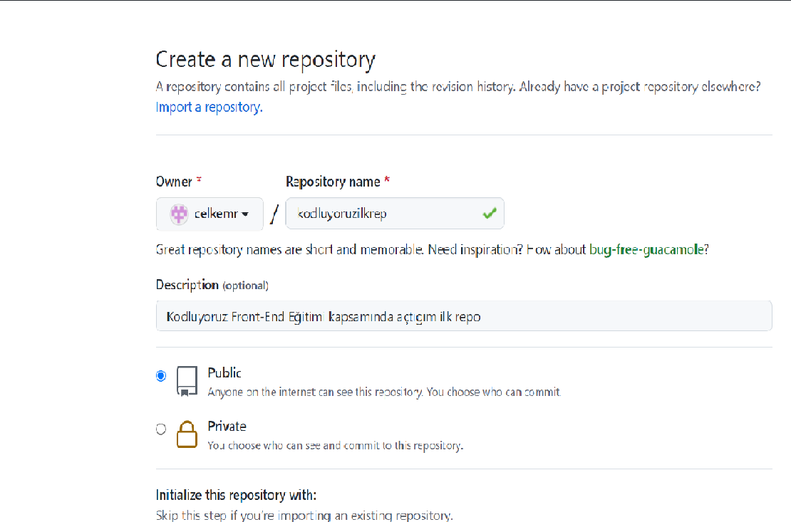

# **Kodluyoruz Ilk Repo**
Bu repo [Kodluyoruz](https://github.com/celkemr89/kodluyoruzilkrepo) Front-End Eğitiminden oluşturduğumuz ilk repo. İçerisinde bir adet README dosyası,bir adet de index.html barındırıyor.




## **Installation**
Öncelikle projeyi clonelayın (Buraya sizin reponuzdan aldıgınız link gelecek)
> git clone https://github.com/celkemr89/kodluyoruzilkrepo.git
## **Usage**

Projeyi klonladıktan sonra Visual Studio Code programında açınız.

Linux için:

```
cd kodluyoruzilkrepo
code .

```
## **Contributing**

Pull requestler kabul edilir. Büyük degişiklikler için,lütfen önce neyi degiştirmek istediginizi tartışmak için bir konu açınız.

## **License**

[MIT](https://github.com/celkemr/kodluyoruzilkrepo/blob/main/LICENSE)